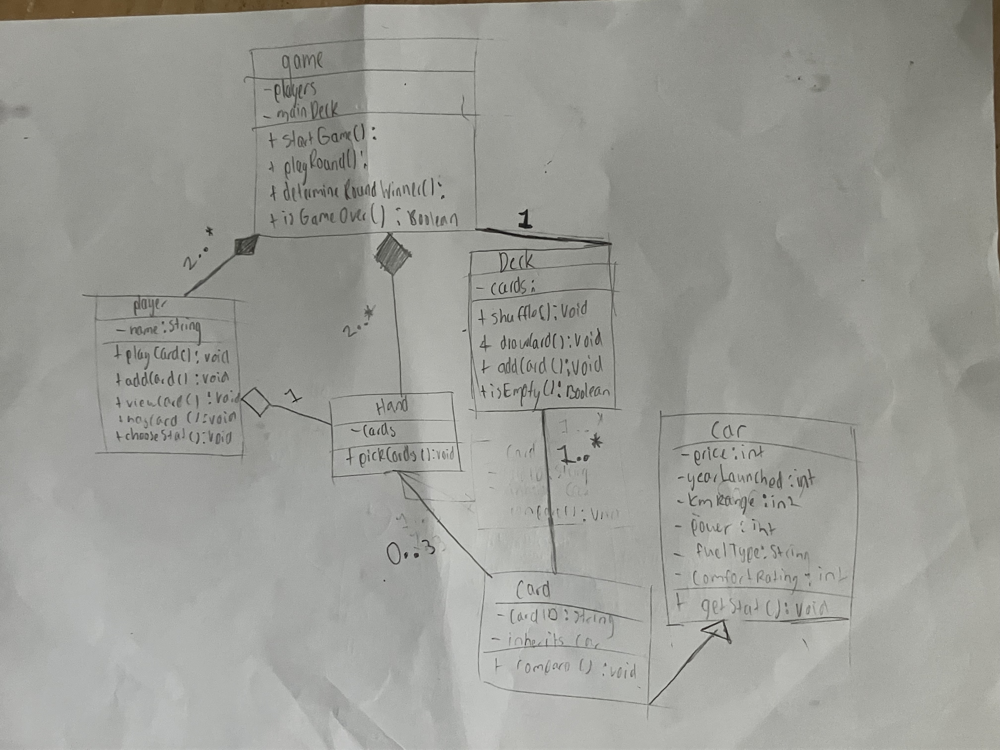
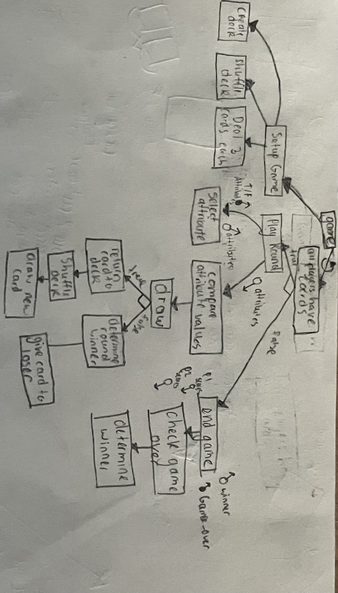
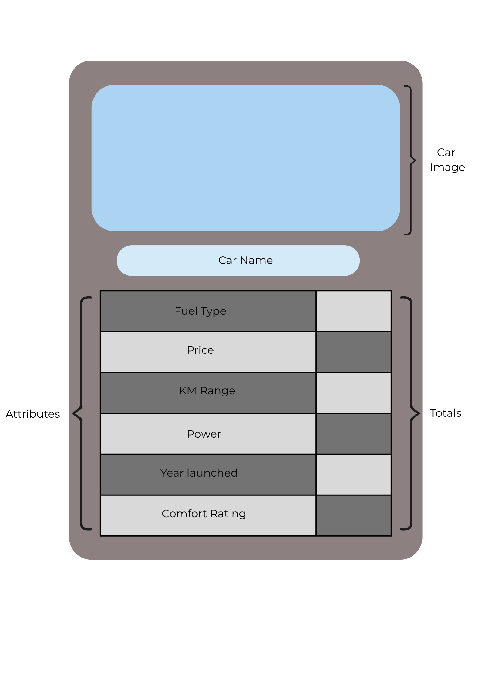
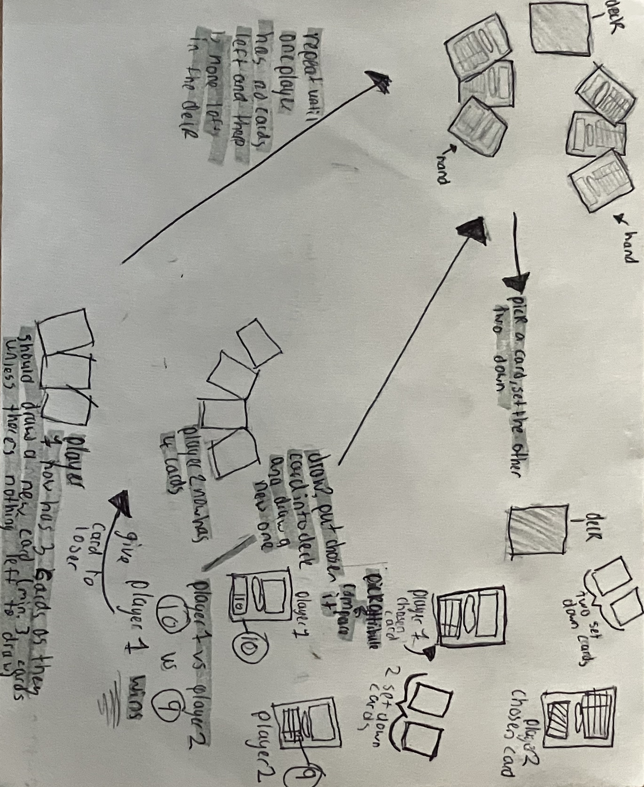
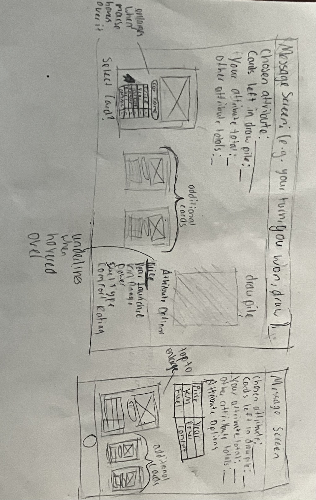

# Assessment Task 2: Object-Oriented Design Project: Car Comparison Game

## Part A - Data Selection and Game Attributes (10 marks)

### Chosen Attributes (ranked from most powerful to least powerful)
**Price:** (very high variation, it can come close due to specific prices)  
**Year launched:** (high variation)  
**KM Range:**  (high variation)  
**Power:** (more uniform between cars, but not very uniform, there is still a large range)  
**Fuel Type:** (only a couple types, but if you have electric you're guaranteed to win)  
**Comfort Rating:** (lower variation, less chances to win + subjective, making it possibly unfair)   

### Why each attribute was chosen and what makes it fair/unfair in gameplay
**Price:** This attribute was chosen because it was easy to measure and has a large range, making it more fair during gameplay  
**Year launched:** This attribute was chosen because there are both old and new cars, however, it can be slightly unfair if one car was made in the 1900s and another car was made this year  
**KM Range:** This attribute was chosen as the KM range depends on the type of car you have, but it also has a wide enough variety. It's relatively fair in gameplay due to the range  
**Power:** This attribute was chosen due to being an important factor of cars, and it is fair in gameplay due to the variety  
**Fuel Type:** This attribute was chosen in order to promote sustainability, but it could be unfair due to the small range of choices  
**Comfort Rating:** This attribute was chosen to have a break from the larger numbers, so there is only a range of 1-10 for options, making it fair to compare  

## Part B - Class Design (10 marks)
### Design the object-oriented structure of your game.
### Required classes:
- Car
- Card
- Deck
- Player
- Game

## Part C - Class Diagram (10 marks)

## Part D - Game Mechanics Design (10 marks)
### *Explain*  how the game works:

Each player should have three or more cards in their hand, unless there are no cards left in the draw pile (if there is less than 3, draw another card. The draw pile is shared between the players). Each player picks a card from their hand, and sets the other two cards down.The person left to the dealer picks an attribute first, and announces both the attribute and their value. The game will go clockwise from then on, until each player has announced their value. The player with the best value will give their card to the player with the worst value. Once the round ends, the losing player (player who recieved an extra card) will announce the new attribute. If there is a draw at any moment, everyone will put their cards at the bottom of the deck, shuffle the deck, and draw a new card. The game ends once there is no draw pile, and someone runs out of cards. 

The game is balanced as everyone picks a card at the same time, and they are each limited to that singular card. If you are the 'losing player', you will have an advantage in the next round to pick the attribute to avoid losing multiple times in a row. One unfair advantage is what happens during a draw; if you were bound to lose, your card gets put inside the pile regardless, and you get to pick a new card, which is unfair to the people which would've won. Making a set of rules to avoid this is extremely complicated due to the possibility of outcomes depending on how many players there are (e.g. 2 players is fair, 3 players the person who isn't in a draw could keep their card, 4 players if the top two people were in a draw they gave a card each to the lowest two scoring players, 4 players if the middle two people draw it doesn't matter), however, this is possible and will be implemented as an advanced version to the game.

### Rules for winning a round
**Year launched:** newest wins  
**Price:** lowest wins  
**KM Range:** highest wins  
**Power:** highest wins  
**Fuel Type (best to worst):** electric, hybrid, gasoline/petrol, diesel  
**Comfort Rating:** highest wins   

### Advanced Gameplay
# PUT IN EXTRA RULES
### Structure chart

## Part E - Interface and Card Design (5 marks)
### Card Design

### Storyboard Walkthrough

### Wireframe

## Part F - Social, Ethical, and Legal Implications (5 marks)
You must **critically analyse** how your car comparison game immpacts individuals, society, and the environment. Using your designed system, respond to the following:
### 1. **Individual Impact**
- How could your game influence user behaviour or decision-making?
    ####    My game influences decision-making as it is a fast-paced, decision-based game that allows the user to challenge both themselves and others through picking a card at the start of the game, which means they will need to choose their cards wisely, and also picking the correct attribute from their card in order to win. Both of these actions require an appropriate skill set of decision-making and elimination processes. 
- Could it encourage bias (e.g. favouring expensive or high-performance cars)?
    ####    Yes, it could encourage bias, specifically towards those cars more economically sustainable, and those that perform generally well in terms of power and distance. 
- What responsibilities do you have as a designer to present fair information?
    ####    As a designer, you have to present fair information, otherwise the game is innacurate, unfair, and not a factually based game. 
### 2. **Social Impact**
- How might your game reinforce stereotypes or inequalities (e.g. wealth, status, access to vehicles)?
    ####    My game might reinforce stereotypes regarding newer cars are 'better', or cars with a high km range/power are 'better', but it really depends on your wants/needs.
- Does your system favour certain types of users or cars?
    ####    My system favours cars that are electric, as it is more straightforwards to win, and it also favours the cars that are newer, which are also (coincidentally) often electric.
- How could your design be made more inclusive or fair?
    ####    My design could be made more inclusive or fair by choosing attributes that are easier to compare with each other (total-wise), by picking simpler attributes, or by picking attributes that can't be seen as biased or harmful
### 3. **Environmental Impact**
- How could your game influence attitudes towards fuel use, emissions, or sustainability?  
    ####   My game influences attitudes towards fuel use, as depending on the sustainability of the fuel, it's ranked from best to worst. If your card is electric, it's guaranteed to win a round, therefore integrating the idea that it is a better fuel type, enforcing using more sustainable fuels.  
- Does your attribute selection promote or ignore environmental considerations?
    ####    Some of my attribute selection promotes environmental considerations, with the fuel type promoting it, and comfort rating/km range/price might influence a players decisions when buying a car, as a car that uses a better fuel type combined with good ratings in those categories might make a player want to buy the 'better' car, promoting more sustainable cars. However, the power and year launched do not matter as much.
- What changes could you make to encourage more environmentally responsible thinking?
  ####    Some changes I could make would be to implement a 'sustainability' attribute, or to add in more attributes that focus on sustainability. However, it makes the game less fun with less diversity, and it would feel more like an advertisement focused to promote environmental concerns, rather than a game.
### 4. **Legal Considerations**
- What legal issues could arise from using real-world car data (e.g. ownership, copyright, accuracy)?
  ####    Many legal issues could arise from using real-world car data; The game could encounter problems due to copyright from using branded cars and models, or not acknowledge the owners of the cars/models, which could in turn lead to legal consequences. 
- What responsibilities do you have when displaying or using data inspired by platforms like carsales.com.au
  ####    When using data inspired from platforms like carsales.com.au, your responsibility could include fact-checking to make sure the information is factually correct when using it in your own projects, and you would also need to acknowledge that it came from another source. You also cannot publicise other people's personal information, whether that be the sellers contact  name, details, or something else.
- How would you ensure your system avoids misleading users?
  #### I would ensure my system avoids misleading users by lining out clear instructions, and providing as much information required to properly use the system. 

